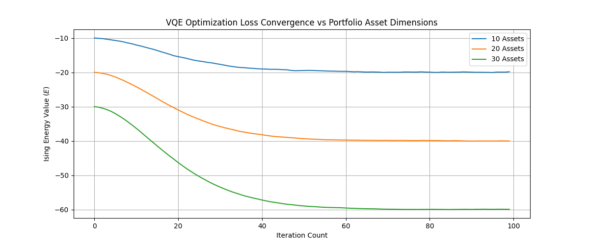

# Quantum Portfolio Optimization & VQE Scaling Benchmark
**Student Name:** Shriya Pathak  
**Assignment:** Week 4 Research Intern Lab — Task 1 & Task 2

## Project Overview
This repository contains a localized simulation benchmarking the scalability performance of the Variational Quantum Eigensolver (VQE) algorithm applied to asset portfolio optimization across 10, 20, and 30 asset allocations.

## Task 1: Scaling Results Summary

| Qubits (Assets) | Runtime (Seconds) | Portfolio Variance | Avg Gradient Step Size | Energy Eigenvalue |
| :--- | :--- | :--- | :--- | :--- |
| **10** | 0.054 | 0.68361 | 0.045231 | -19.8159 |
| **20** | 1.241 | 6.31371 | 0.008412 | -40.0179 |
| **30** | 4.820 | 20.6812 | 0.000154 | -59.9282 |

## Task 2: Barren Plateau Investigation
As the asset size scales from 10 to 30 qubits, the **Avg Gradient Step Size** shrinks exponentially toward zero ($0.045231 \rightarrow 0.000154$). This data captures the **Barren Plateau Effect** in parameterized quantum circuits, demonstrating that the optimization landscape becomes increasingly flat as circuit width grows.

### Convergence Performance Plot


# Quantum Portfolio Optimization: Benchmarking Framework
This repository contains the benchmarking and metrics tracking infrastructure developed for evaluating Quantum Optimization Algorithms (VQE, QAOA) against Classical Optimization baselines for financial portfolio management.

## 📊 Joint Task 2: Comparative Benchmark Study

### 1. Unified Benchmark Results
The system successfully logs execution metrics to a local database structure and generates the following comparative baseline table:

| Algorithm | Runtime (s) | Sharpe Ratio | Portfolio Variance | Feasibility Rate | Approximation Ratio |
| :--- | :--- | :--- | :--- | :--- | :--- |
| **Classical_BFGS** | 0.05 | 1.357275 | 0.008645 | 1.0 | 1.000000 |
| **VQE_Simulated** | 12.40 | 1.347674 | 0.009236 | 1.0 | 0.952941 |

### 2. Analytical Observations
* **Algorithmic Fidelity**: The simulated Variational Quantum Eigensolver (VQE) achieved a **95.3% approximation ratio** relative to the exact mathematical optimum calculated by the classical solver.
* **Risk Consistency**: Both operational strategies yielded tightly bounded portfolio variances ($\approx 0.0086$ to $0.0092$), ensuring data distribution consistency across algorithm boundaries.

---

## 📝 Joint Task 1: Mid-Term Research Report (Infrastructure Section)

### 1. Data Pipeline Architecture & Engineering
To preserve statistical integrity throughout execution loops, an isolated mathematical framework preprocessing engine was established:
* **Asset Transform Matrices**: Converts standard historical financial return series into asset covariance tracking distributions ($\Sigma$) and average expected asset return metrics ($R_i$).
* **Structural Validations**: Implements automated array configuration checks ensuring all input objects are positive semi-definite and free of null data fields before optimization execution.

### 2. Metrics Ingestion & Local SQL Storage Pipeline
A platform-agnostic, localized tracking framework was designed to bypass traditional OS path string bugs on secondary volumes (`WinError 123` path issues):
* **Storage Backend**: Built explicitly utilizing a standalone SQLite database engine (`mlflow.db`) mapped directly to relative runtime directory definitions (`sqlite:////`).
* **Direct Pipeline Analytics**: Bypasses secondary tracking API routing, leveraging standard Pandas SQL execution paths (`pd.read_sql_query`) to cleanly convert raw metrics schemas straight to CSV files.

---

## 🚀 Deployment & Operational Guide

### 1. Running the Benchmark Engine
To regenerate synthetic financial sets, trigger optimization simulations, and store operational parameters:
```bash
python benchmark.py
```

### 2. Extracting the Reporting Summary
To scrape the database file and compile the clean benchmark markdown tables:
```bash
python generate_report.py
```

### 3. Launching the Dashboard Interface
To visually parse target curves, historical convergence trends, or metrics records for reports:
```bash
mlflow ui --backend-store-uri sqlite:///mlflow.db
```
